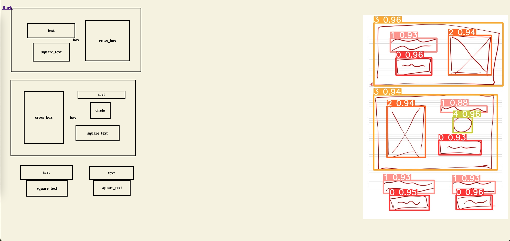

# Img2html



## Run on host
```shell
python3 -m venv venv
source venv/bin/activate
pip install -r requirements.txt
uvicorn main:app --host 0.0.0.0 --port 80
```


## Docker
```shell
docker build -t figma .
docker run -p 1113:80 figma
```